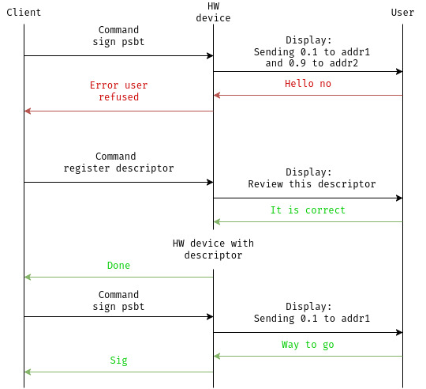
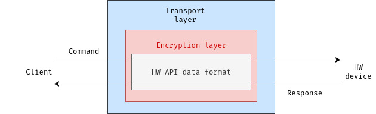
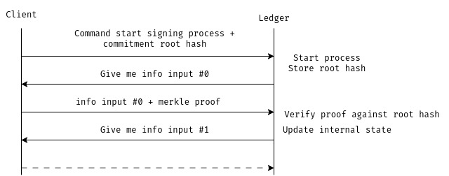
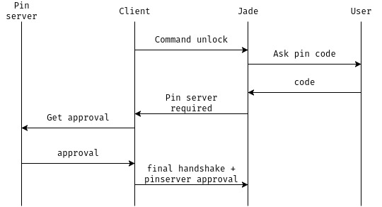

# Hardware wallets, can we find a common interface ?

The context section is rather long and may not interest you. You can skip to
the implementation [details section](#BHWI).

There is also a btcpp talk, were bhwi concept is explained with a ugly french accent.

[](https://www.youtube.com/watch?v=G8xR57uKnBg)

## Context

Hardware wallet is the vernacular name given to some specialized device storing
keys in the Bitcoin ecosystem. The name is confusing, especially for newcomers,
who must understand the distinction between wallets running on desktop and
mobile, connected to the Bitcoin network, and these devices, the few electronic
device that engineers do not want to connect to a global network (unlike modern
appliances).

This isolation serves as both the unifying trait and the central value
proposition presented to customers. Beyond that, anything goes—as many flavors
as there are opinions on key handling and each year new products are released.

There are legitimate reasons users may be put off:

- The elephant in the room: these are dedicated devices with a target on their
  back. They may be vulnerable to supply chain attacks.
- Personal security can actually worsen after purchase, as it may create a trail
  linking consumer information to cryptocurrency ownership.
- Too much trust on the manufacturer and difficulty of audit.
- Price
- Too easy to spot. Public is becoming well aware of what they are.

Some products mitigate all four first issues by offering a DIY approach using
generic, non-cryptocurrency-related components. Hardware remains practically
impossible for most of us to audit, though some initiatives are attempting to
change that.[^1]. However, achieving strong protection against key extraction
attacks requires dedicated hardware. The most secure option is a secure element,
a specialized tamper-resistant chip widely used in passports, credit cards, and
other high-security applications. Hardware wallets vary in how they use secure
elements: some only store keys on the chip while performing signatures in a less
secure component, whereas others run the entire computation within the secure
element itself.

Secure computation is, in my opinion, the most underestimated aspect of hardware
wallets. As evidence, I point to the proliferation of blind signing
devices—products that do not display transaction data and sign without truly
verifying what they're approving. The term "signing device" was even proposed as
a replacement for the confusing "hardware wallet" label, which itself reflects
how narrowly these tools are often conceived. The security benefit of isolation
is negated if the user's mobile or laptop is still trusted to verify
transactions and addresses. By addresses, I mean not
only transaction recipient addresses but receiving and change addresses.
Also, proper verification means performing the entire derivation from the stored
secret and displaying the result to the user. The key value of Hardware wallets
lies in their ability to reproduce results by performing the calculations
themselves. They are not just "signing", they are "reproducing" and let user
checks that result is the desired output.

At Wizardsardine, we expect our users to use hardware wallets. We do not want
our softwares to manage private keys and we do not trust that users personal laptops
and phones won't one day be compromised. We believe most of the drawbacks
of hardware wallets are resolved by using multiple keys setup like Multisig.
By using multiple products from multiple providers, Users can mitigate risk and
get the benefits of each device, but with the tradeoff of needing coordination.
Multisig is yet another layer of Bitcoin knowledge that newcomers must
digest—often after months of figuring out keys and derivation paths. Many users
see the complexity as not worth the cost, and as usual with Bitcoin's messy
ecosystem, it comes with plenty of footguns (for example, failing to back up
public keys). Thanks to tireless work from wallet developers, the UX is
improving every year, and at Wizardsardine we believe Miniscript now changes
the equation.

Miniscript let us express complex spending policies in a standardized, analyzable way.
The resulting output descriptor encodes everything required for any compatible
wallet to reconstruct the Bitcoin setup from it. It brings simpler backups, better
interoperability, and richer functionality. For example, instead of lowering
the multisig threshold to handle key loss, thresholds can remain unanimous with
recovery keys that activate after a timelock. Since 2020, we have focused on
advancing Miniscript adoption throughout the Bitcoin ecosystem, from Bitcoin
core integration to encouraging new standard like BIP 388.
After working on a covenant-less vault solution, we developed a simpler
Miniscript wallet called Liana to tackle the chicken-and-egg problem: hardware
wallet manufacturers refused to allocate resources to Miniscript due to lack of
demand, while users remained uninterested in solutions without strong security
guarantees. The tide has since turned: we now proudly support five different
hardware wallet brands and we've eased up on pestering the remaining
manufacturers.

As our product line is set to grow, so does the challenge of developing
reusable software components. This led me to think about how we could build and
maintain a common client library that supports multiple platforms and remains
extensible for developers. As you may have understood from the introduction of
this post, our current scope of supported hardware is limited to devices with:
- a screen
- Miniscript support

## Current state of implementations

There are some initiatives to build this interface, notably:

- HWI: https://github.com/bitcoin-core/HWI (Python)
- Lark: https://github.com/sparrowwallet/lark (Java)
- Async-HWI: https://github.com/Wizardsardine/async-hwi (Rust)

But in my opinion, they lack a little bit of ambition. It is a shame that we
have to reimplement the same interfaces again and again in each language, and
we should not require new wallets to embed a full Python runtime or the JVM.
That's why, based on the experience gained from developing async-hwi, I have
been working on a new Rust library called BHWI (Bitcoin Hardware Wallet
Interface) to try a new approach.

## BHWI

In the rest of this post, I will attempt to explain my reasoning about creating
BHWI, but first I want to illustrate with a common flow common flow
between a client and a device while registering a miniscript descriptor and
signing a transaction.



The signing command includes PSBT information containing the unsigned
transaction inputs and outputs, along with their respective bip32_derivation
fields. These fields allow the hardware wallet to determine which derivation
paths to use for deriving the private keys needed to sign and the public keys
needed to verify addresses. In this example, the first signing attempt occurs
without the miniscript descriptor registered in the wallet's memory. Without
the descriptor, the hardware wallet cannot reproduce the script for the change
address and will treat the second output as external.
After registering the miniscript descriptor, however, the hardware wallet can
verify that the remaining funds are returning to a wallet address it controls.
I wanted to illustrate that proper use of a hardware wallet typically
requires multiple commands from the interface—not just a single signing
request.

If we wanted a Rust crate supporting multiple client implementations, we would
likely define a common trait like this:

```rust
pub trait HWI {
    type Error;
    fn register_descriptor(&mut self, desc: &Descriptor) -> Result<(), Self::Error>
    fn sign_psbt(&mut self, psbt: &mut Psbt) -> Result<(), Self::Error>
    ...
}

impl HWI for Device {
    ...
}

```

Between the client and the device, multiple layers modify and parse the data as
it travels through the transport stack.



Since the transport layer may vary for a given device while the API remains
constant, a client implementation would abstract over the transport, keeping
the invariant API logic separate from the variable communication layer.


```rust
pub struct Device<T: Transport> {
    transport: T,
    encryption_engine: device_encryption::Engine
}

pub trait Transport {
    type Error;
    fn send(&mut self, request: &[u8]) -> Result<Vec<u8>, Self;:Error>
}

impl HWI for Device {
    fn register_descriptor(&mut self, desc: &Descriptor) -> Result<(), Self::Error> {
        let response = device_encoding::encode(desc)
            .and_then(|request| self.encryption_engine.encrypt(request))
            .and_then(|encrypted_request| self.transport.send(encrypted_request))
            .and_then(|encrypted_response| self.encryption_engine.decrypt(encrypted_response))
            .and_then(|data| device_encoding::decode(data));
        response.into_result()
    }
    ...
}
```

I/O is at the heart of the method. Unfortunately, this is precisely the part
where a library should minimize its footprint, leaving the developer in
control. Modern programming languages—notably Rust—are introducing async
features that provide proper cancellation propagation and safety. At the same
time, we don't want to mandate async usage either. Many developers are
frustrated by the "function coloring" problem, where async infects the entire
call stack. Async also may complicate FFI bindings: there's no stable ABI for
async functions, each language has its own async model and Rust's runtime
dependency may not translate well across language boundaries. To address these
concerns, we can redesign the library to follow a sans-I/O pattern, separating
the logic into methods that run before and after the I/O operation itself.


```rust
pub enum Command {
    GetXpub(DerivationPath),
    RegisterDescriptor(Descriptor),
    ...
}

pub enum Response {
    Xpub(Xpub),
    ...
}

fn command(engine: &mut EncryptionEngine, cmd: &Command) -> Result<Vec<u8>, Error> {
    engine.encrypt(self.device::encode(cmd))
}

fn response(engine: &mut EncryptionEngine, cmd: &Command, encrypted_data: Vec<u8>) -> Result<Response, Error>  {
    let data = engine.decrypt(encrypted_data)?;
    match cmd {
        Command::GetXpub => Response::Xpub(Xpub::from_vec(&data)?)
        ...
    }
}
```

This gives developers full control over how I/O is performed asynchronously or not,
through any other execution model they prefer. As a result developers can
define themselves differents traits with their implementations according to
their needs:

```rust
impl HWI for Device {
    fn get_xpub(&mut self, path: &DerivationPath) -> Result<Xpub, Self::Error> {
        let cmd = Command::GetXpub(path);
        let req = command(&mut self.encryption_engine, &cmd);
        let data = self.transport.send(cmd);
        let Response::Xpub(xpub) = response(&mut self.encryption_engine, &cmd, data)?;
        Ok(xpub)
    }
}

impl AsyncHWI for Device {
    async fn get_xpub(&mut self, path: &DerivationPath) -> Result<Xpub, Self::Error> {
        ...
        let data = self.transport.send(cmd).await?;
        ...
    }
}
```

If it seems good enough, that underestimates the ingenuity of some device APIs.
For example, Ledger uses a clever trick with Merkle trees to save memory space:
it delegates some storage to the client while protecting against tampering
through a Merkle tree scheme. First, a Merkle root hash of the data is provided
as a commitment. Then, whenever the device requests a chunk of data from the
client, that chunk must be accompanied by its corresponding Merkle proof.





Putting the burden on developers to manually call the entire cycle in their
code, handling all the commands themselves, would be unfortunate. So we should
revisit our interfaces to really understand what we're building. We want to
interpret what a client wants from a device, how the device responds, whether
it's yielding a response or asking for more data, and so on.

An interpreter then holds the client state in the context of its exchanges with
the device. It updates itself as data arrives and finally returns the response
once ready. This trait could look like:


```rust
pub trait Interpreter {
    type Command;
    type Response;
    type Error;
    fn start(&mut self, command: Self::Command) -> Result<Vec<u8>, Self::Error>;
    fn update(&mut self, data: Vec<u8>) -> Result<Option<Vec<u8>>, Self::Error>;
    fn end(&mut self) -> Result<Response>, Self::Error>;
}

```

Then, when a developer wants to use the client interpreter for a device API or
a common interpreter shared across multiple device APIs, they can write inside they
async methods for example:

```rust
    let request = self.start(command.into())?;
    let mut data = self.transport.exchange(request).await?;
    loop {
        match self.update(data)? {
            Some(req) =>  {
                data = self.transport.exchange().await?;
            }
            None => break;
        }
    }
    self.end()
}

```

Are we done yet? Not yet. We tackled the interpretation of client and devices,
but what about third parties? For example, Jade from Blockstream uses an
external PIN server that must be contacted to exchange information with the
device in order to unlock it. The device key is encrypted and cannot be
decrypted without this exchange. The PIN server enforces protection against
brute force attacks by refusing any further requests after three failed
attempts.

Here is the typical four-party exchange between the client, the PIN server, the
device, and the user:





So in the end, we can introduce to our interpreter a fourth field, the transmit,
wrapping data destined to a recipient. The interpreter then do the router between multiple recipients

```rust
pub trait Interpreter {
    type Command;
    type Transmit;
    type Response;
    type Error;
    fn start(&mut self, command: Self::Command) -> Result<Self::Transmit, Self::Error>;
    fn exchange(&mut self, data: Vec<u8>) -> Result<Option<Self::Transmit>, Self::Error>;
    fn end(self) -> Result<Self::Response, Self::Error>;
}

pub struct JadeInterpreter{...}

pub enum JadeRecipient {
    Device,
    PinServer { url: String },
}

pub struct JadeTransmit {
    pub recipient: Recipient,
    pub payload: Vec<u8>,
}

```

Then, end consumers of the library (developers) take care of handling the
transmissions, and in the case of the Jade PIN server, can use whatever HTTP
library they want. This is particularly useful for WASM, as HTTP requests must
be delegated to the browser's fetch API. They can write inside their async
methods, for example:

```rust
let transmit = intpr.start(command)?;
let exchange = transport.send(&transmit.payload, transmit.encrypted).await?;
let mut transmit = intpr.exchange(exchange)?;
while let Some(t) = &transmit {
    match &t.recipient {
        Recipient::PinServer { url } => {
            let res = http_client.request(url, &t.payload).await?;
            transmit = intpr.exchange(res)?;
        }
        Recipient::Device => {
            let exchange = transport.senf(&t.payload).await?;
            transmit = intpr.exchange(exchange)?;
        }
    }
}
```

To summarize, I think it would be valuable to give developers maximum
flexibility while finding a common interface across all hardware wallets. The
approach would be to implement a device specific interpreter for each API,
handling its own commands, responses, and transmissions and then abstract
these into a common Interpreter that unifies all device interactions under a
single interface.

[^1]: https://betrusted.io/
